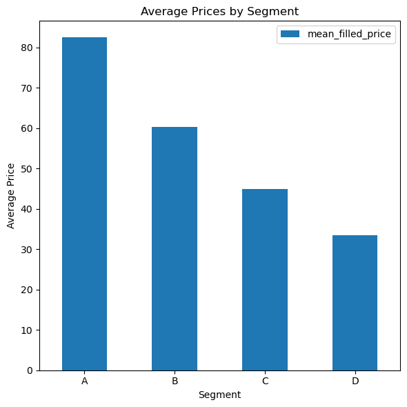

# Customer Segmentation with Gezinomi Data

[Click here](README.tr.md) for Turkish documentation.

## Content

- [Introduction](#introduction)
- [Uploading and Transforming Data in the Database](#uploading-and-transforming-data-in-the-database)
- [Segmentation of Booking Habits](#segmentation-of-booking-habits)
- [Grouping by Average Price and Record Count](#grouping-by-average-price-and-record-count)
- [Creating the Sales Level Column](#creating-the-sales-level-column)
- [Creating Price Segments](#creating-price-segments)
- [Conclusion](#conclusion)

---

## Introduction

This project aims to analyze Gezinomi's sales data, create new customer segments and develop strategic recommendations for these segments. In the project, data loading, transformation, missing data handling and segmentation steps are carried out, along with visualizations in Python to better understand the data.

### Dataset and Tools

- Miuul Gezinomi Dataset

- WSL2 & Ubuntu 24.04

- PostgreSQL 15

- Python 3.12

### Dataset Details

| Variable               |      Function       |                                        Description                                        |
| ---------------------- | :-----------------: | :---------------------------------------------------------------------------------------: |
| **SaleId**             |       Sale ID       |                       A unique identifier for each sale transaction                       |
| **SaleDate**           |      Sale Date      |                        The date when the sale transaction occurred                        |
| **CheckInDate**        | Hotel Check-In Date |                       The date the customer checked into the hotel                        |
| **Price**              |     Sale Price      |                         The amount the customer paid for the sale                         |
| **ConceptName**        | Hotel Concept Info  | The service concept of the hotel where the sale occurred (e.g., all-inclusive, room-only) |
| **SaleCityName**       |      City Info      |                            The city where the hotel is located                            |
| **CInDay**             | Hotel Check-In Day  |         The day of the week when the customer checked in (e.g., Monday, Tuesday)          |
| **SaleCheckInDayDiff** |   Day Difference    |       The difference in days between the sale date and the customer's check-in date       |
| **Season**             |     Season Info     | The season during which the customer checked into the hotel (e.g., summer, winter season) |

---

## Uploading and Transforming Data in the Database

### Step 1: Data Upload and Table Creation

The first 5 rows of the dataset were displayed to examine its structure:

```bash
head -5 ~/datasets/miuul_gezinomi.csv
```

**Sample Output:**

```
SaleId,SaleDate,CheckInDate,Price,ConceptName,SaleCityName,CInDay,SaleCheckInDayDiff,Seasons
415122,2022-12-03 00:00:00,2022-12-03 00:00:00,79.3040293,Herşey Dahil,Antalya,Saturday,0,Low
415103,2022-12-03 00:00:00,2022-12-03 00:00:00,45.97069597,Yarım Pansiyon,Antalya,Saturday,0,Low
404034,2022-09-12 00:00:00,2022-09-13 00:00:00,77.83882784,Herşey Dahil,Antalya,Tuesday,1,High
415094,2022-12-03 00:00:00,2022-12-10 00:00:00,222.7106227,Yarım Pansiyon,İzmir,Saturday,7,Low
```

Based on this data, the `public.gezinomi` table was created using the following query:

```sql
create table public.gezinomi(
  sale_id int,
  sale_date timestamp,
  check_in_date timestamp,
  price float,
  concept_name text,
  sale_city_name text,
  c_in_day text,
  sale_check_in_day_diff int,
  seasons text
);
```

The following command was used to determine the file path of the dataset:

```bash
readlink -f ~/datasets/miuul_gezinomi.csv
```

**Sample Output:**

```
/root/datasets/miuul_gezinomi.csv
```

The dataset was imported into the `public.gezinomi` table using the file path above and the `\copy` command:

```bash
\copy public.gezinomi
from '/root/datasets/miuul_gezinomi.csv'
delimiter ','
csv header;
```

The table was verified using the following query:

```sql
select * from public.gezinomi limit 5;
```

**Sample Output:**

```
sale_id|sale_date              |check_in_date          |price      |concept_name  |sale_city_name|c_in_day|sale_check_in_day_diff|seasons|
-------+-----------------------+-----------------------+-----------+--------------+--------------+--------+----------------------+-------+
 415122|2022-12-03 00:00:00.000|2022-12-03 00:00:00.000| 79.3040293|Herşey Dahil  |Antalya       |Saturday|                     0|Low    |
 415103|2022-12-03 00:00:00.000|2022-12-03 00:00:00.000|45.97069597|Yarım Pansiyon|Antalya       |Saturday|                     0|Low    |
 404034|2022-09-12 00:00:00.000|2022-09-13 00:00:00.000|77.83882784|Herşey Dahil  |Antalya       |Tuesday |                     1|High   |
 415094|2022-12-03 00:00:00.000|2022-12-10 00:00:00.000|222.7106227|Yarım Pansiyon|İzmir         |Saturday|                     7|Low    |
 414951|2022-12-01 00:00:00.000|2022-12-03 00:00:00.000|140.4761905|Yarım Pansiyon|İzmir         |Saturday|                     2|Low    |
```

### Step 2: Checking and Filling Missing Data

Missing data was checked using the following query and it was found that there were only `13` missing values in the `price` column:

```sql
select
  count(1) as total_rows,
  sum(case when sale_id is null then 1 else 0 end) as missing_sale_id,
  sum(case when sale_date is null then 1 else 0 end) as missing_sale_date,
  sum(case when check_in_date is null then 1 else 0 end) as missing_check_in_date,
  sum(case when price is null then 1 else 0 end) as missing_price,
  sum(case when concept_name is null then 1 else 0 end) as missing_concept_name,
  sum(case when sale_city_name is null then 1 else 0 end) as missing_sale_city_name,
  sum(case when c_in_day is null then 1 else 0 end) as missing_c_in_day,
  sum(case when sale_check_in_day_diff is null then 1 else 0 end) as missing_sale_check_in_day_diff,
  sum(case when seasons is null then 1 else 0 end) as missing_seasons
from public.gezinomi;
```

**Sample Output:**

```
total_rows|missing_sale_id|missing_sale_date|missing_check_in_date|missing_price|missing_concept_name|missing_sale_city_name|missing_c_in_day|missing_sale_check_in_day_diff|missing_seasons|
----------+---------------+-----------------+---------------------+-------------+--------------------+----------------------+----------------+------------------------------+---------------+
     59164|              0|                0|                    0|           13|                   0|                     0|               0|                             0|              0|
```

To maintain data integrity, the `13` missing values in the `price` column were filled with the average and the `public.gezinomi_filled_price` table was created:

```sql
create table public.gezinomi_filled_price as
select
  g.*,
  coalesce(
    price, (
      select
        avg(price)
      from public.gezinomi
      where price is not null
    )
  ) as filled_price
from public.gezinomi g;
```

The table was verified using the following query:

```sql
select * from public.gezinomi_filled_price limit 5;
```

**Sample Output:**

```
sale_id|sale_date              |check_in_date          |price      |concept_name  |sale_city_name|c_in_day|sale_check_in_day_diff|seasons|filled_price|
-------+-----------------------+-----------------------+-----------+--------------+--------------+--------+----------------------+-------+------------+
 415122|2022-12-03 00:00:00.000|2022-12-03 00:00:00.000| 79.3040293|Herşey Dahil  |Antalya       |Saturday|                     0|Low    |  79.3040293|
 415103|2022-12-03 00:00:00.000|2022-12-03 00:00:00.000|45.97069597|Yarım Pansiyon|Antalya       |Saturday|                     0|Low    | 45.97069597|
 404034|2022-09-12 00:00:00.000|2022-09-13 00:00:00.000|77.83882784|Herşey Dahil  |Antalya       |Tuesday |                     1|High   | 77.83882784|
 415094|2022-12-03 00:00:00.000|2022-12-10 00:00:00.000|222.7106227|Yarım Pansiyon|İzmir         |Saturday|                     7|Low    | 222.7106227|
 414951|2022-12-01 00:00:00.000|2022-12-03 00:00:00.000|140.4761905|Yarım Pansiyon|İzmir         |Saturday|                     2|Low    | 140.4761905|
```

---

## Segmentation of Booking Habits

This study aims to create a table (`public.gezinomi_sales`) that classifies booking habits based on the difference between the sale and check-in dates (`sale_check_in_day_diff`) and displays this classification in a new column named `eb_score`, using the data from the `public.gezinomi_filled_price` table.

| Range       |    Description     |
| ----------- | :----------------: |
| **0 - 7**   |   Last Minuters    |
| **7 - 30**  | Potential Planners |
| **30 - 90** |      Planners      |
| **Others**  |   Early Bookers    |

The `public.gezinomi_sales` table was created using the following query:

```sql
create table public.gezinomi_sales as
select
  gfp.*,
  case
    when sale_check_in_day_diff >= 0  and sale_check_in_day_diff < 7  then 'Last Minuters'
    when sale_check_in_day_diff >= 7  and sale_check_in_day_diff < 30 then 'Potential Planners'
    when sale_check_in_day_diff >= 30 and sale_check_in_day_diff < 90 then 'Planners'
    else 'Early Bookers'
  end as eb_score
from
  public.gezinomi_filled_price gfp;
```

The table was verified using the following query:

```sql
select * from public.gezinomi_sales limit 5;
```

**Sample Output:**

```
sale_id|sale_date              |check_in_date          |price      |concept_name  |sale_city_name|c_in_day|sale_check_in_day_diff|seasons|filled_price|eb_score          |
-------+-----------------------+-----------------------+-----------+--------------+--------------+--------+----------------------+-------+------------+------------------+
 415122|2022-12-03 00:00:00.000|2022-12-03 00:00:00.000| 79.3040293|Herşey Dahil  |Antalya       |Saturday|                     0|Low    |  79.3040293|Last Minuters     |
 415103|2022-12-03 00:00:00.000|2022-12-03 00:00:00.000|45.97069597|Yarım Pansiyon|Antalya       |Saturday|                     0|Low    | 45.97069597|Last Minuters     |
 404034|2022-09-12 00:00:00.000|2022-09-13 00:00:00.000|77.83882784|Herşey Dahil  |Antalya       |Tuesday |                     1|High   | 77.83882784|Last Minuters     |
 415094|2022-12-03 00:00:00.000|2022-12-10 00:00:00.000|222.7106227|Yarım Pansiyon|İzmir         |Saturday|                     7|Low    | 222.7106227|Potential Planners|
 414951|2022-12-01 00:00:00.000|2022-12-03 00:00:00.000|140.4761905|Yarım Pansiyon|İzmir         |Saturday|                     2|Low    | 140.4761905|Last Minuters     |
```

|                      Record Counts                      |                Percentage Distribution                |
| :-----------------------------------------------------: | :---------------------------------------------------: |
|  |  |

---

## Grouping by Average Price and Record Count

This study aims to create a table (`public.gezinomi_sales_scs`) containing the average prices and record counts grouped by city, concept and seasons, using the data from the `public.gezinomi_sales` table.

The `public.gezinomi_sales_scs` table was created using the following query:

```sql
create table public.gezinomi_sales_scs as
select
  sale_city_name,
  concept_name,
  seasons,
  avg(filled_price) as mean_filled_price,
  count(1) as count
from
  public.gezinomi_sales
group by
  sale_city_name,
  concept_name,
  seasons
order by
  mean_filled_price desc;
```

The table was verified using the following query:

```sql
select * from public.gezinomi_sales_scs limit 5;
```

**Sample Output:**

```
sale_city_name|concept_name  |seasons|mean_filled_price |count|
--------------+--------------+-------+------------------+-----+
Girne         |Herşey Dahil  |High   |103.93544772963638|   55|
Girne         |Herşey Dahil  |Low    | 90.93594415568627|   51|
Diğer         |Herşey Dahil  |Low    | 87.31088205333339|  141|
İzmir         |Yarım Pansiyon|High   | 87.21876511413751|  120|
Diğer         |Herşey Dahil  |High   | 83.72578761878981|  365|
```

|                                Record Counts                                |                              Average Prices                               |
| :-------------------------------------------------------------------------: | :-----------------------------------------------------------------------: |
|  |  |

---

## Creating the Sales Level Column

This study aims to create a table (`public.gezinomi_sales_level_based`) that includes a new column named `sales_level_based`, combining city, concept and season information into a single column, using the data from the `public.gezinomi_sales_scs` table.

The `public.gezinomi_sales_level_based` table was created using the following query:

```sql
create table public.gezinomi_sales_level_based as
select
  gsscs.*,
  regexp_replace(replace(replace(upper(lower(concat(
    gsscs.sale_city_name, '_',
    gsscs.concept_name, '_',
    gsscs.seasons
  ))), 'Ğ', 'G'), 'Ş', 'S'), '(\x20\+\x20)|(\x20)', '_', 'g') as sales_level_based
from
  public.gezinomi_sales_scs gsscs;
```

The table was verified using the following query:

```sql
select * from public.gezinomi_sales_level_based limit 5;
```

**Sample Output:**

```
sale_city_name|concept_name  |seasons|mean_filled_price |count|sales_level_based        |
--------------+--------------+-------+------------------+-----+-------------------------+
Girne         |Herşey Dahil  |High   |103.93544772963638|   55|GIRNE_HERSEY_DAHIL_HIGH  |
Girne         |Herşey Dahil  |Low    | 90.93594415568627|   51|GIRNE_HERSEY_DAHIL_LOW   |
Diğer         |Herşey Dahil  |Low    | 87.31088205333339|  141|DIGER_HERSEY_DAHIL_LOW   |
İzmir         |Yarım Pansiyon|High   | 87.21876511413751|  120|IZMIR_YARIM_PANSIYON_HIGH|
Diğer         |Herşey Dahil  |High   | 83.72578761878981|  365|DIGER_HERSEY_DAHIL_HIGH  |
```

|                                        Record Counts                                        |                                      Average Prices                                       |
| :-----------------------------------------------------------------------------------------: | :---------------------------------------------------------------------------------------: |
|  |  |

---

## Creating Price Segments

This study aims to create a table (`public.gezinomi_segment`) that divides the data into four different price segments using the `mean_filled_price` column in the `public.gezinomi_sales_level_based` table.

To define the price segments, the statistics of the `mean_filled_price` column were calculated first. For this purpose, the following query was executed to obtain the minimum, maximum, average and quartile values (Q1, median, Q3):

```sql
select
  min(mean_filled_price) as min_price,
  max(mean_filled_price) as max_price,
  avg(mean_filled_price) as avg_price,
  percentile_cont(0.25) within group (order by mean_filled_price) as q1,
  percentile_cont(0.50) within group (order by mean_filled_price) as median,
  percentile_cont(0.75) within group (order by mean_filled_price) as q3
from
  public.gezinomi_sales_level_based;
```

**Sample Output:**

```
min_price        |max_price         |avg_price         |q1                |median           |q3              |
-----------------+------------------+------------------+------------------+-----------------+----------------+
25.27179906636364|103.93544772963638|55.242616924406306|39.668844692983626|54.54449490004546|65.2570406454706|
```

The segment ranges are as follows:

| Range              |      Description      |
| ------------------ | :-------------------: |
| **25.27 - 39.67**  |    D (Low Segment)    |
| **39.67 - 54.54**  |  C (Medium Segment)   |
| **54.54 - 65.26**  |   B (High Segment)    |
| **65.26 - 103.94** | A (Very High Segment) |

Based on these segment ranges, the `public.gezinomi_segment` table was created using the following query:

```sql
create table public.gezinomi_segment as
select
  gslb.*,
  case
    when mean_filled_price >= 25.27 and mean_filled_price <= 39.67 then 'D'
    when mean_filled_price >  39.67 and mean_filled_price <= 54.54 then 'C'
    when mean_filled_price >  54.54 and mean_filled_price <= 65.26 then 'B'
    else 'A'
  end as segment
from
  public.gezinomi_sales_level_based gslb;
```

The table was verified using the following query:

```sql
select * from public.gezinomi_segment limit 5;
```

**Sample Output:**

```
sale_city_name|concept_name  |seasons|mean_filled_price |count|sales_level_based        |segment|
--------------+--------------+-------+------------------+-----+-------------------------+-------+
Girne         |Herşey Dahil  |High   |103.93544772963638|   55|GIRNE_HERSEY_DAHIL_HIGH  |A      |
Girne         |Herşey Dahil  |Low    | 90.93594415568627|   51|GIRNE_HERSEY_DAHIL_LOW   |A      |
Diğer         |Herşey Dahil  |Low    | 87.31088205333339|  141|DIGER_HERSEY_DAHIL_LOW   |A      |
İzmir         |Yarım Pansiyon|High   | 87.21876511413751|  120|IZMIR_YARIM_PANSIYON_HIGH|A      |
Diğer         |Herşey Dahil  |High   | 83.72578761878981|  365|DIGER_HERSEY_DAHIL_HIGH  |A      |
```

|                              Record Counts                              |                            Average Prices                             |
| :---------------------------------------------------------------------: | :-------------------------------------------------------------------: |
|  |  |

---

## Conclusion

- **Last-Minute Customers (Last Minuters)**: Since they constitute a significant portion of sales, special last-minute campaigns and discounts should be applied to this segment.

- **High Price and Registered Regions**: Certain cities and concepts experience high prices and registrations during specific seasons. More aggressive marketing strategies should be adopted for high-priced concepts in these regions.

- **High Segment Customers (Segment B)**: This segment represents the largest customer base. Although they fall within the average price range, they expect high standards of accommodation and service. Therefore, campaigns targeting this segment should maintain a price-performance balance while offering exclusive perks.
