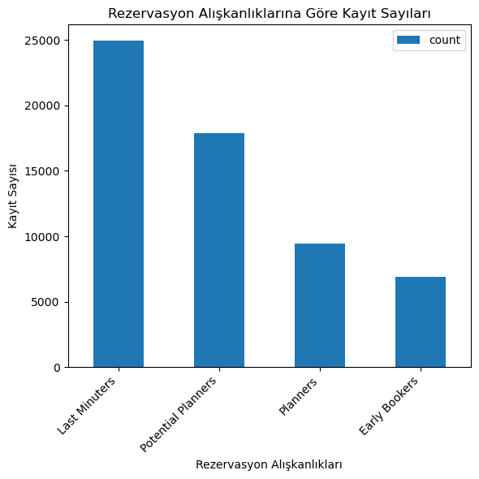
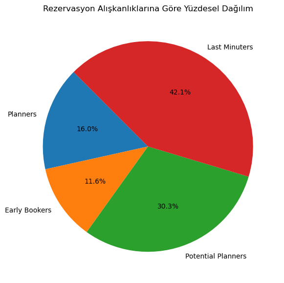
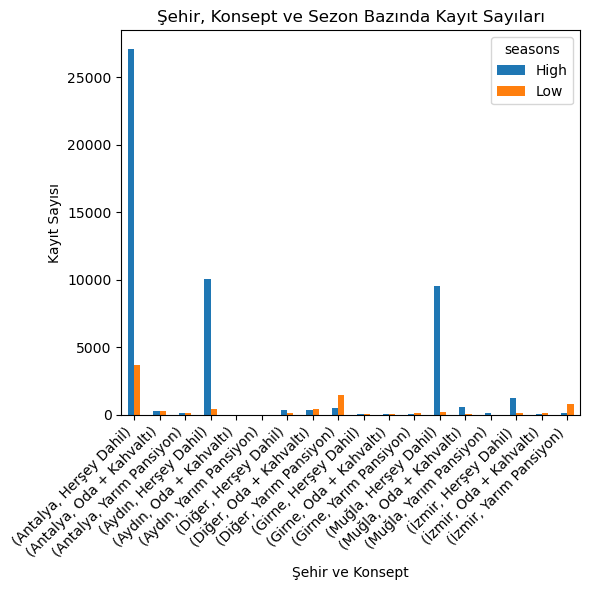
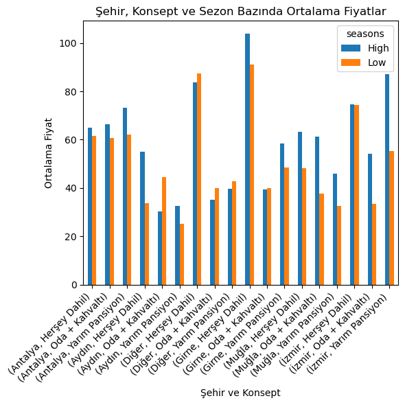
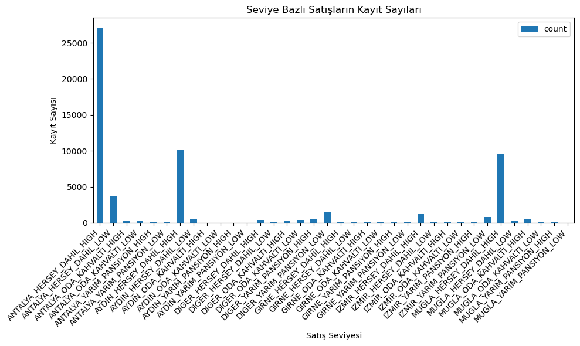
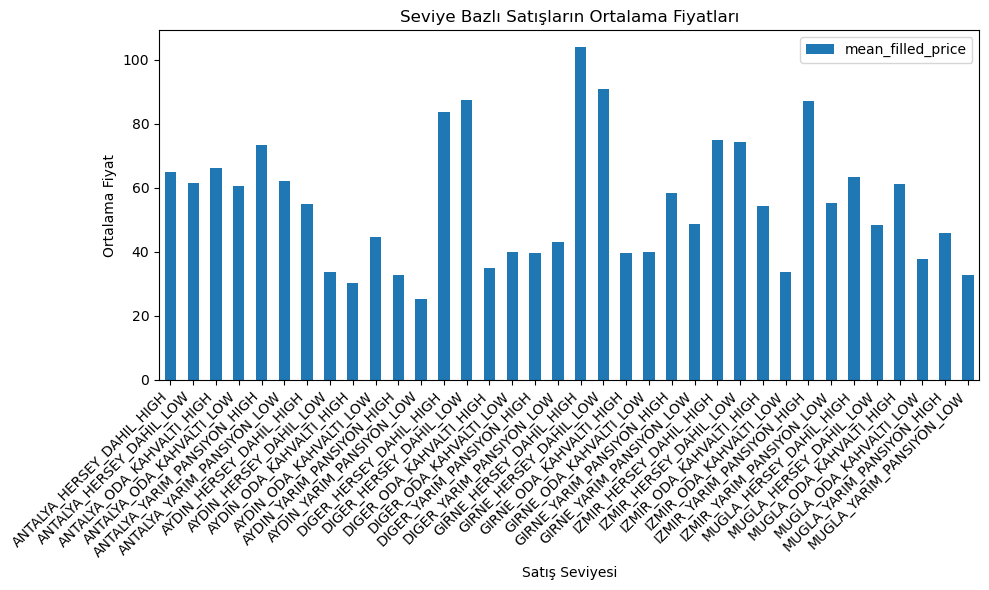
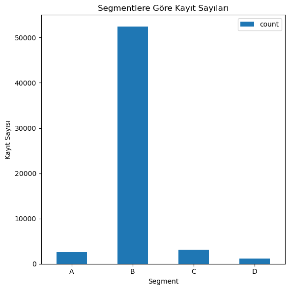
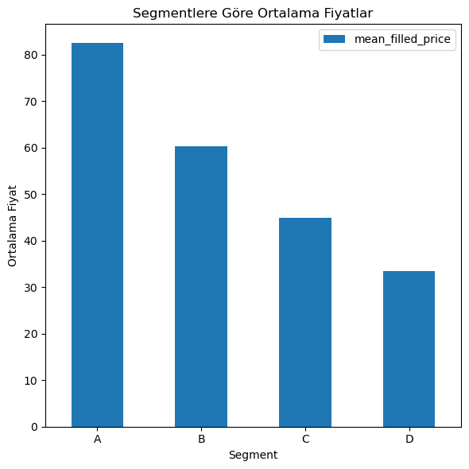

# Gezinomi Verileriyle Müşteri Segmentasyonu

İngilizce dökümantasyon için [buraya tıklayın](README.md).

## İçerik

- [Giriş](#giriş)
- [Veritabanına Veri Yükleme ve Dönüştürme](#veritabanına-veri-yükleme-ve-dönüştürme)
- [Rezervasyon Alışkanlıklarının Segmentasyonu](#rezervasyon-alışkanlıklarının-segmentasyonu)
- [Ortalama Fiyat ve Kayıt Sayısı Gruplandırması](#ortalama-fiyat-ve-kayıt-sayısı-gruplandırması)
- [Satış Seviyesi Kolonu Oluşturma](#satış-seviyesi-kolonu-oluşturma)
- [Fiyat Segmentleri Oluşturma](#fiyat-segmentleri-oluşturma)
- [Sonuç](#sonuç)

---

## Giriş

Bu proje, Gezinomi'nin satış verilerini analiz ederek yeni müşteri segmentleri oluşturmayı ve bu segmentlere özel stratejik öneriler geliştirmeyi hedeflemektedir. Projede veri yükleme, dönüştürme, eksik veri işleme ve segmentasyon adımlarının yanı sıra, verilerin daha iyi anlaşılması için Python ile görselleştirme çalışmaları yapılmıştır.

### Kullanılacak Veri Seti ve Araçlar

- Miuul Gezinomi Veri Seti

- WSL2 & Ubuntu 24.04

- PostgreSQL 15

- Python 3.12

### Veri Seti Detayları

| Değişken               |        İşlev         |                                          Açıklama                                           |
| ---------------------- | :------------------: | :-----------------------------------------------------------------------------------------: |
| **SaleId**             |       Satış ID       |                   Her bir satış işlemi için benzersiz bir kimlik numarası                   |
| **SaleDate**           |     Satış Tarihi     |                             Satış işleminin gerçekleştiği tarih                             |
| **CheckInDate**        |  Otele Giriş Tarihi  |                        Müşterinin otelde konaklamaya başladığı tarih                        |
| **Price**              |     Satış Fiyatı     |                             Satış için müşterinin ödediği tutar                             |
| **ConceptName**        | Otel Konsept Bilgisi | Satış yapılan otelin hizmet konsepti (örneğin, her şey dahil, oda-kahvaltı, yarım pansiyon) |
| **SaleCityName**       |    Şehir Bilgisi     |                            Satışı yapılan otelin bulunduğu şehir                            |
| **CInDay**             |   Otele Giriş Günü   |         Müşterinin otelde check-in yaptığı haftanın günü (örneğin, Pazartesi, Salı)         |
| **SaleCheckInDayDiff** |      Gün Farkı       |             Satış tarihi ile müşterinin otele giriş tarihi arasındaki gün farkı             |
| **Season**             |    Sezon Bilgisi     |   Müşterinin otele giriş yaptığı tarihteki sezon durumu (örneğin, yaz sezonu, kış sezonu)   |

---

## Veritabanına Veri Yükleme ve Dönüştürme

### Adım 1: Veri Yükleme ve Tablo Oluşturma

Veri setinin yapısını incelemek için ilk 5 satırı görüntülenmiştir:

```bash
head -5 ~/datasets/miuul_gezinomi.csv
```

**Örnek Çıktı:**

```
SaleId,SaleDate,CheckInDate,Price,ConceptName,SaleCityName,CInDay,SaleCheckInDayDiff,Seasons
415122,2022-12-03 00:00:00,2022-12-03 00:00:00,79.3040293,Herşey Dahil,Antalya,Saturday,0,Low
415103,2022-12-03 00:00:00,2022-12-03 00:00:00,45.97069597,Yarım Pansiyon,Antalya,Saturday,0,Low
404034,2022-09-12 00:00:00,2022-09-13 00:00:00,77.83882784,Herşey Dahil,Antalya,Tuesday,1,High
415094,2022-12-03 00:00:00,2022-12-10 00:00:00,222.7106227,Yarım Pansiyon,İzmir,Saturday,7,Low
```

Bu verilere göre `public.gezinomi` tablosu aşağıdaki sorgu ile oluşturulmuştur:

```sql
create table public.gezinomi(
  sale_id int,
  sale_date timestamp,
  check_in_date timestamp,
  price float,
  concept_name text,
  sale_city_name text,
  c_in_day text,
  sale_check_in_day_diff int,
  seasons text
);
```

Veri setinin dosya yolunu öğrenmek için aşağıdaki komut kullanılmıştır:

```bash
readlink -f ~/datasets/miuul_gezinomi.csv
```

**Örnek Çıktı:**

```
/root/datasets/miuul_gezinomi.csv
```

Veri seti yukarıdaki dosya yolu ve `\copy` komutu ile `public.gezinomi` tablosuna aktarılmıştır:

```bash
\copy public.gezinomi
from '/root/datasets/miuul_gezinomi.csv'
delimiter ','
csv header;
```

Aşağıdaki sorgu ile tablo kontrol edilmiştir:

```sql
select * from public.gezinomi limit 5;
```

**Örnek Çıktı:**

```
sale_id|sale_date              |check_in_date          |price      |concept_name  |sale_city_name|c_in_day|sale_check_in_day_diff|seasons|
-------+-----------------------+-----------------------+-----------+--------------+--------------+--------+----------------------+-------+
 415122|2022-12-03 00:00:00.000|2022-12-03 00:00:00.000| 79.3040293|Herşey Dahil  |Antalya       |Saturday|                     0|Low    |
 415103|2022-12-03 00:00:00.000|2022-12-03 00:00:00.000|45.97069597|Yarım Pansiyon|Antalya       |Saturday|                     0|Low    |
 404034|2022-09-12 00:00:00.000|2022-09-13 00:00:00.000|77.83882784|Herşey Dahil  |Antalya       |Tuesday |                     1|High   |
 415094|2022-12-03 00:00:00.000|2022-12-10 00:00:00.000|222.7106227|Yarım Pansiyon|İzmir         |Saturday|                     7|Low    |
 414951|2022-12-01 00:00:00.000|2022-12-03 00:00:00.000|140.4761905|Yarım Pansiyon|İzmir         |Saturday|                     2|Low    |
```

### Adım 2: Eksik Veri Kontrolü ve Doldurulması

Eksik veriler aşağıdaki sorgu ile kontrol edilmiş ve yalnızca `price` kolonunda `13` eksik değer olduğu tespit edilmiştir:

```sql
select
  count(1) as total_rows,
  sum(case when sale_id is null then 1 else 0 end) as missing_sale_id,
  sum(case when sale_date is null then 1 else 0 end) as missing_sale_date,
  sum(case when check_in_date is null then 1 else 0 end) as missing_check_in_date,
  sum(case when price is null then 1 else 0 end) as missing_price,
  sum(case when concept_name is null then 1 else 0 end) as missing_concept_name,
  sum(case when sale_city_name is null then 1 else 0 end) as missing_sale_city_name,
  sum(case when c_in_day is null then 1 else 0 end) as missing_c_in_day,
  sum(case when sale_check_in_day_diff is null then 1 else 0 end) as missing_sale_check_in_day_diff,
  sum(case when seasons is null then 1 else 0 end) as missing_seasons
from public.gezinomi;
```

**Örnek Çıktı:**

```
total_rows|missing_sale_id|missing_sale_date|missing_check_in_date|missing_price|missing_concept_name|missing_sale_city_name|missing_c_in_day|missing_sale_check_in_day_diff|missing_seasons|
----------+---------------+-----------------+---------------------+-------------+--------------------+----------------------+----------------+------------------------------+---------------+
     59164|              0|                0|                    0|           13|                   0|                     0|               0|                             0|              0|
```

Veri bütünlüğünü korumak amacıyla, `price` kolonundaki `13` eksik değer ortalama ile doldurulmuş ve `public.gezinomi_filled_price` tablosu oluşturulmuştur:

```sql
create table public.gezinomi_filled_price as
select
  g.*,
  coalesce(
    price, (
      select
        avg(price)
      from public.gezinomi
      where price is not null
    )
  ) as filled_price
from public.gezinomi g;
```

Aşağıdaki sorgu ile tablo kontrol edilmiştir:

```sql
select * from public.gezinomi_filled_price limit 5;
```

**Örnek Çıktı:**

```
sale_id|sale_date              |check_in_date          |price      |concept_name  |sale_city_name|c_in_day|sale_check_in_day_diff|seasons|filled_price|
-------+-----------------------+-----------------------+-----------+--------------+--------------+--------+----------------------+-------+------------+
 415122|2022-12-03 00:00:00.000|2022-12-03 00:00:00.000| 79.3040293|Herşey Dahil  |Antalya       |Saturday|                     0|Low    |  79.3040293|
 415103|2022-12-03 00:00:00.000|2022-12-03 00:00:00.000|45.97069597|Yarım Pansiyon|Antalya       |Saturday|                     0|Low    | 45.97069597|
 404034|2022-09-12 00:00:00.000|2022-09-13 00:00:00.000|77.83882784|Herşey Dahil  |Antalya       |Tuesday |                     1|High   | 77.83882784|
 415094|2022-12-03 00:00:00.000|2022-12-10 00:00:00.000|222.7106227|Yarım Pansiyon|İzmir         |Saturday|                     7|Low    | 222.7106227|
 414951|2022-12-01 00:00:00.000|2022-12-03 00:00:00.000|140.4761905|Yarım Pansiyon|İzmir         |Saturday|                     2|Low    | 140.4761905|
```

---

## Rezervasyon Alışkanlıklarının Segmentasyonu

Bu çalışma, `public.gezinomi_filled_price` tablosundaki verileri kullanarak, satış ve giriş tarihleri arasındaki farka (`sale_check_in_day_diff`) göre rezervasyon alışkanlıklarını sınıflandıran ve bu sınıflandırmayı `eb_score` adında yeni bir sütunda gösteren bir tablo (`public.gezinomi_sales`) oluşturmayı amaçlamaktadır.

| Aralık      |                   Açıklama                    |
| ----------- | :-------------------------------------------: |
| **0 - 7**   |        Last Minuters (Son Dakikacılar)        |
| **7 - 30**  | Potential Planners (Potansiyel Planlamacılar) |
| **30 - 90** |           Planners (Planlamacılar)            |
| **Diğer**   |  Early Bookers (Erken Rezervasyon Yapanlar)   |

`public.gezinomi_sales` tablosu aşağıdaki sorgu ile oluşturulmuştur:

```sql
create table public.gezinomi_sales as
select
  gfp.*,
  case
    when sale_check_in_day_diff >= 0  and sale_check_in_day_diff < 7  then 'Last Minuters'
    when sale_check_in_day_diff >= 7  and sale_check_in_day_diff < 30 then 'Potential Planners'
    when sale_check_in_day_diff >= 30 and sale_check_in_day_diff < 90 then 'Planners'
    else 'Early Bookers'
  end as eb_score
from
  public.gezinomi_filled_price gfp;
```

Aşağıdaki sorgu ile tablo kontrol edilmiştir:

```sql
select * from public.gezinomi_sales limit 5;
```

**Örnek Çıktı:**

```
sale_id|sale_date              |check_in_date          |price      |concept_name  |sale_city_name|c_in_day|sale_check_in_day_diff|seasons|filled_price|eb_score          |
-------+-----------------------+-----------------------+-----------+--------------+--------------+--------+----------------------+-------+------------+------------------+
 415122|2022-12-03 00:00:00.000|2022-12-03 00:00:00.000| 79.3040293|Herşey Dahil  |Antalya       |Saturday|                     0|Low    |  79.3040293|Last Minuters     |
 415103|2022-12-03 00:00:00.000|2022-12-03 00:00:00.000|45.97069597|Yarım Pansiyon|Antalya       |Saturday|                     0|Low    | 45.97069597|Last Minuters     |
 404034|2022-09-12 00:00:00.000|2022-09-13 00:00:00.000|77.83882784|Herşey Dahil  |Antalya       |Tuesday |                     1|High   | 77.83882784|Last Minuters     |
 415094|2022-12-03 00:00:00.000|2022-12-10 00:00:00.000|222.7106227|Yarım Pansiyon|İzmir         |Saturday|                     7|Low    | 222.7106227|Potential Planners|
 414951|2022-12-01 00:00:00.000|2022-12-03 00:00:00.000|140.4761905|Yarım Pansiyon|İzmir         |Saturday|                     2|Low    | 140.4761905|Last Minuters     |
```

|                     Kayıt Sayıları                      |                   Yüzdesel Dağılım                    |
| :-----------------------------------------------------: | :---------------------------------------------------: |
|  |  |

---

## Ortalama Fiyat ve Kayıt Sayısı Gruplandırması

Bu çalışma, `public.gezinomi_sales` tablosundaki verileri kullanarak, şehir, konsept ve sezonlara göre gruplandırılmış ortalama fiyatları ve kayıt sayılarını içeren bir tablo (`public.gezinomi_sales_scs`) oluşturmayı amaçlamaktadır.

`public.gezinomi_sales_scs` tablosu aşağıdaki sorgu ile oluşturulmuştur:

```sql
create table public.gezinomi_sales_scs as
select
  sale_city_name,
  concept_name,
  seasons,
  avg(filled_price) as mean_filled_price,
  count(1) as count
from
  public.gezinomi_sales
group by
  sale_city_name,
  concept_name,
  seasons
order by
  mean_filled_price desc;
```

Aşağıdaki sorgu ile tablo kontrol edilmiştir:

```sql
select * from public.gezinomi_sales_scs limit 5;
```

**Örnek Çıktı:**

```
sale_city_name|concept_name  |seasons|mean_filled_price |count|
--------------+--------------+-------+------------------+-----+
Girne         |Herşey Dahil  |High   |103.93544772963638|   55|
Girne         |Herşey Dahil  |Low    | 90.93594415568627|   51|
Diğer         |Herşey Dahil  |Low    | 87.31088205333339|  141|
İzmir         |Yarım Pansiyon|High   | 87.21876511413751|  120|
Diğer         |Herşey Dahil  |High   | 83.72578761878981|  365|
```

|                               Kayıt Sayıları                                |                             Ortalama Fiyatlar                             |
| :-------------------------------------------------------------------------: | :-----------------------------------------------------------------------: |
|  |  |

---

## Satış Seviyesi Kolonu Oluşturma

Bu çalışma, `public.gezinomi_sales_scs` tablosundaki verileri kullanarak, şehir, konsept ve sezon bilgilerini tek bir kolonda birleştiren `sales_level_based` adında yeni bir kolon içeren bir tablo (`public.gezinomi_sales_level_based`) oluşturmayı amaçlamaktadır.

`public.gezinomi_sales_level_based` tablosu aşağıdaki sorgu ile oluşturulmuştur:

```sql
create table public.gezinomi_sales_level_based as
select
  gsscs.*,
  regexp_replace(replace(replace(upper(lower(concat(
    gsscs.sale_city_name, '_',
    gsscs.concept_name, '_',
    gsscs.seasons
  ))), 'Ğ', 'G'), 'Ş', 'S'), '(\x20\+\x20)|(\x20)', '_', 'g') as sales_level_based
from
  public.gezinomi_sales_scs gsscs;
```

Aşağıdaki sorgu ile tablo kontrol edilmiştir:

```sql
select * from public.gezinomi_sales_level_based limit 5;
```

**Örnek Çıktı:**

```
sale_city_name|concept_name  |seasons|mean_filled_price |count|sales_level_based        |
--------------+--------------+-------+------------------+-----+-------------------------+
Girne         |Herşey Dahil  |High   |103.93544772963638|   55|GIRNE_HERSEY_DAHIL_HIGH  |
Girne         |Herşey Dahil  |Low    | 90.93594415568627|   51|GIRNE_HERSEY_DAHIL_LOW   |
Diğer         |Herşey Dahil  |Low    | 87.31088205333339|  141|DIGER_HERSEY_DAHIL_LOW   |
İzmir         |Yarım Pansiyon|High   | 87.21876511413751|  120|IZMIR_YARIM_PANSIYON_HIGH|
Diğer         |Herşey Dahil  |High   | 83.72578761878981|  365|DIGER_HERSEY_DAHIL_HIGH  |
```

|                                       Kayıt Sayıları                                        |                                     Ortalama Fiyatlar                                     |
| :-----------------------------------------------------------------------------------------: | :---------------------------------------------------------------------------------------: |
|  |  |

---

## Fiyat Segmentleri Oluşturma

Bu çalışma, `public.gezinomi_sales_level_based` tablosundaki `mean_filled_price` kolonunu kullanarak verileri dört farklı fiyat segmentine ayıran bir tablo (`public.gezinomi_segment`) oluşturmayı amaçlamaktadır.

Fiyat segmentlerini belirlemek için öncelikle `mean_filled_price` kolonunun istatistikleri hesaplanmıştır. Bu amaçla aşağıdaki sorgu çalıştırılarak minimum, maksimum, ortalama ve çeyrek değerleri (Q1, medyan, Q3) elde edilmiştir:

```sql
select
  min(mean_filled_price) as min_price,
  max(mean_filled_price) as max_price,
  avg(mean_filled_price) as avg_price,
  percentile_cont(0.25) within group (order by mean_filled_price) as q1,
  percentile_cont(0.50) within group (order by mean_filled_price) as median,
  percentile_cont(0.75) within group (order by mean_filled_price) as q3
from
  public.gezinomi_sales_level_based;
```

**Örnek Çıktı:**

```
min_price        |max_price         |avg_price         |q1                |median           |q3              |
-----------------+------------------+------------------+------------------+-----------------+----------------+
25.27179906636364|103.93544772963638|55.242616924406306|39.668844692983626|54.54449490004546|65.2570406454706|
```

Segment aralıkları aşağıdaki gibidir:

| Aralık             |        Açıklama        |
| ------------------ | :--------------------: |
| **25.27 - 39.67**  |   D (Düşük Segment)    |
| **39.67 - 54.54**  |    C (Orta Segment)    |
| **54.54 - 65.26**  |   B (Yüksek Segment)   |
| **65.26 - 103.94** | A (Çok Yüksek Segment) |

Segment aralıklarına göre `public.gezinomi_segment` tablosu aşağıdaki sorgu ile oluşturulmuştur:

```sql
create table public.gezinomi_segment as
select
  gslb.*,
  case
    when mean_filled_price >= 25.27 and mean_filled_price <= 39.67 then 'D'
    when mean_filled_price >  39.67 and mean_filled_price <= 54.54 then 'C'
    when mean_filled_price >  54.54 and mean_filled_price <= 65.26 then 'B'
    else 'A'
  end as segment
from
  public.gezinomi_sales_level_based gslb;
```

Aşağıdaki sorgu ile tablo kontrol edilmiştir:

```sql
select * from public.gezinomi_segment limit 5;
```

**Örnek Çıktı:**

```
sale_city_name|concept_name  |seasons|mean_filled_price |count|sales_level_based        |segment|
--------------+--------------+-------+------------------+-----+-------------------------+-------+
Girne         |Herşey Dahil  |High   |103.93544772963638|   55|GIRNE_HERSEY_DAHIL_HIGH  |A      |
Girne         |Herşey Dahil  |Low    | 90.93594415568627|   51|GIRNE_HERSEY_DAHIL_LOW   |A      |
Diğer         |Herşey Dahil  |Low    | 87.31088205333339|  141|DIGER_HERSEY_DAHIL_LOW   |A      |
İzmir         |Yarım Pansiyon|High   | 87.21876511413751|  120|IZMIR_YARIM_PANSIYON_HIGH|A      |
Diğer         |Herşey Dahil  |High   | 83.72578761878981|  365|DIGER_HERSEY_DAHIL_HIGH  |A      |
```

|                             Kayıt Sayıları                              |                           Ortalama Fiyatlar                           |
| :---------------------------------------------------------------------: | :-------------------------------------------------------------------: |
|  |  |

---

## Sonuç

- **Son Dakika Müşterileri (Last Minuters)**: Satışların önemli bir kısmını oluşturdukları için, bu segmente özel son dakika kampanyaları ve indirimleri uygulanmalı.

- **Yüksek Fiyat ve Kayıtlı Bölgeler**: Belirli şehirlerde ve konseptlerde, belirli sezonlarda yüksek fiyatlar ve kayıtlar görülüyor. Bu bölgelerdeki yüksek fiyatlı konseptler için daha agresif pazarlama stratejileri izlenmeli.

- **Yüksek Segment Müşteriler (B Segmenti)**: En büyük müşteri kitlesi bu segmentte. Ortalama fiyat aralığında olsalar da yüksek standartlarda konaklama ve hizmet bekliyorlar. Bu nedenle, bu segmente yönelik kampanyalar hem fiyat-performans dengesini korumalı hem de ayrıcalıklar sunmalı.
